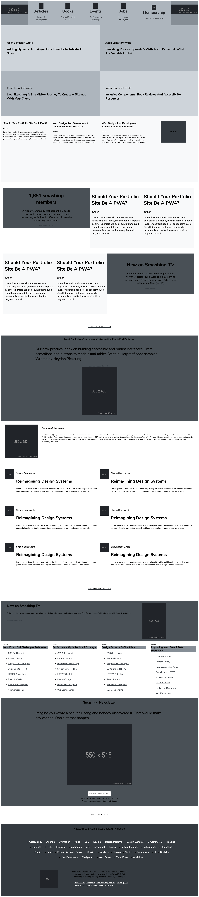

# Design Teardown

> This project consists of building a heatmap of the Smashing magazine website.

Objective is to create a grayscale heat map of the website that indicates which elements have the greatest weight in the visual hierarchy.

[Original page](https://www.smashingmagazine.com/)

## Built With

- HTML5
- CSS3

## Live Demo

[Live Demo Link](https://canriquez.github.io/design_teardown/)

## Getting Started

**fork of clone the project and enjoy**

To get a local copy up and running follow these simple example steps.

### clone  / Foprk the site

## Authors

👤 **Daniel Sokil**

- Github: [@s0kil](https://github.com/s0kil/)

👤 **Carlos Anriquez**

- Github: [@canriquez](https://github.com/canriquez)

## Show your support

Give a ⭐️ if you like this project!

## Acknowledgments

- Hat tip to anyone whose code was used
- Inspiration
- etc

## 📝 License

This project is [MIT](lic.url) licensed.
